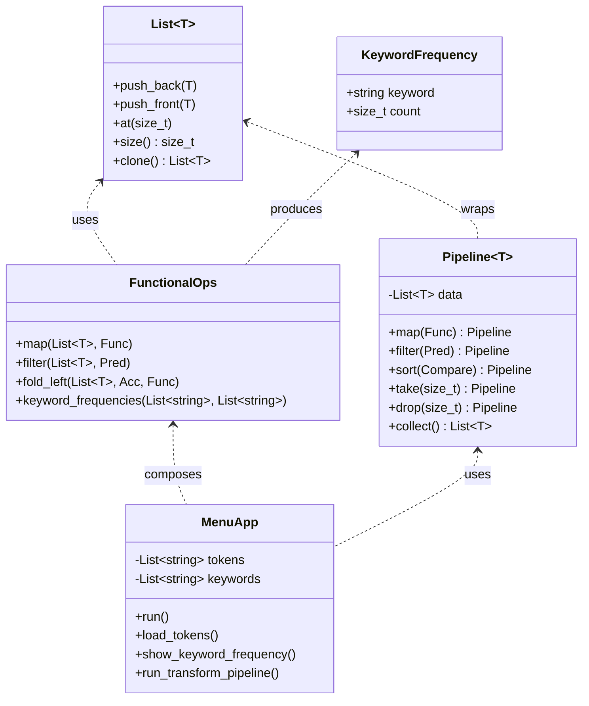

# Member B UML Slice (Mermaid Spec)

```mermaid
classDiagram
    class List~T~ {
        +push_back(T)
        +push_front(T)
        +at(size_t)
        +size() size_t
        +clone() List~T~
    }

    class FunctionalOps {
        +map(List~T~, Func)
        +filter(List~T~, Pred)
        +fold_left(List~T~, Acc, Func)
        +keyword_frequencies(List~string~, List~string~)
    }

    class Pipeline~T~ {
        -List~T~ data
        +map(Func) Pipeline
        +filter(Pred) Pipeline
        +sort(Compare) Pipeline
        +take(size_t) Pipeline
        +drop(size_t) Pipeline
        +collect() List~T~
    }

    class KeywordFrequency {
        +string keyword
        +size_t count
    }

    class MenuApp {
        -List~string~ tokens
        -List~string~ keywords
        +run()
        +load_tokens()
        +show_keyword_frequency()
        +run_transform_pipeline()
    }

    List~T~ <.. FunctionalOps : uses
    List~T~ <.. Pipeline~T~ : wraps
    FunctionalOps <.. MenuApp : composes
    Pipeline~T~ <.. MenuApp : uses
    KeywordFrequency <.. FunctionalOps : produces
```

> Export tip: paste into https://mermaid.live/ or VS Code Mermaid preview, then export PNG to include in the final submission bundle alongside `docs/uml.png`.

